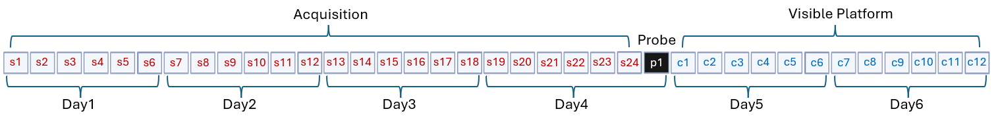

# Barnes Lab

Shared column naming, key-file formats, combining, and the GUI are in the [project README](../README.md). This file covers Barnes import sources and keys.

## Overview


The rats included in the Barnes lab dataset were a part of a Cognitive Aptitude Study using inbred Fischer 344 rats tested across three age groups: 6-7 months old, 15-16 months old, and 23-24 months old (Zempare et al., 2026). Data were collected with ANYMaze, and selected data was exported into Excel. Raw exports are organized by cohort, protocol day, and trial type (Spatial, Probe, Visible). ANYMaze provides an option to compute search error based on corrected integrated path length (CIPL) or by custom functions. Use of different search error calculations result in small differences in some per trial measurements. To take advantage of this feature in ANYMaze, data were exported using both CIPL based calculations (raw data columns contain '_cipl' prefix) as well as in the style used by Gallagher, Rapp, Burke, and McQuail labs (based on Gallagher et. al., 1993; time needed to travel straight line path is removed, these raw data columns contain '_ttr' prefix).

`import_scripts/barnes_import.py` merges per-day raw data CSVs into one wide row per animal and writes `barnes.csv`. Animal IDs are appended with a `.CB` suffix.



## Folder layout

```
barnes/
├── barnes.csv
├── keys/
│   ├── barnes.json
│   └── trial_type_key_barnes.csv
└── rat_data/
    ├── raw/                      # Original ANYMaze CSV exports
    │   └── outfiles/             # Per-cohort wide-format output
    └── database_format/
```

## Import

```powershell
python -m import_scripts.barnes_import
```

1. Read CSVs from `rat_data/raw/`.
2. Group by experiment prefix; classify each file as Spatial, Probe, Visible, or Info from the filename.
3. Split trial files by `Trial`, combine `Date` + `Time` into `datetime_trial`, rename via `keys/barnes.json`.
4. Append suffixes from `keys/trial_type_key_barnes.csv` (protocol trials 1–30).
5. Merge trials per animal; compute `cumulative_time_*`; add metadata constants; write `barnes.csv`.

## Trial column mapping

Spatial and Visible raw columns may include a day-specific prefix (e.g. `AQ D1: TTR to End of test; …`). The import matches by substring using `barnes.json`. After import, names use `cipl_*` / `ttr_*` prefixes; `shared_keys.json` maps them at combine time.

| Standardized variable | Raw data source | Internal name (post-import) |
|-----------------------|-----------------|-----------------------------|
| `dist_total` | `Base; Distance (m)` | `cipl_dist_<type>_<n>` |
| `dist_cum` | `Base; Platform : cumulative distance (` | `cipl_cum_dist_<type>_<n>` |
| `dist_mean` | `Base; Platform : mean distance from (m)` | `cipl_platform_mean_dist_<type>_<n>` |
| `mean_speed` | `Base; Mean speed (m/s)` | `cipl_mean_speed_<type>_<n>` |
| `duration` | `Base; Duration (s)` | `cipl_duration_<type>_<n>` |
| `datetime_trial` | `Date`, `Time` | `datetime_trial_<type>_<n>` (`HH:MM` time) |
| `trial_num` | `Trial` | `trial_num_<type>_<n>` |
| `date` / `time` | `Date` / `Time` | `date_<type>_<n>` / `time_<type>_<n>` |
| `cipl` | `Platform : CIPL (` | `cipl_cipl_<type>_<n>` |

Probe-only quadrant / % time columns are kept under `ttr_*` / `cipl_*` but are not in `shared_keys.json`.

## Metadata

From `*_Info.csv` plus import constants.

| Column | Source / derivation |
|--------|---------------------|
| `animal` | `Barnes_ID:`; `.CB` appended |
| `dob` | `Date_Birth:` (`%m/%d/%Y`) |
| `watermaze_date` | `Date_Start_SpatialWatermaze:` |
| `strain`, `genotype`, `sex`, `age_mo`, `weight`, `housing`, `experiment` | Info file (`housing` normalized to `'Single'`) |
| `lights_on` / `lights_off` | `'7:00'` / `'19:00'` |
| `index_calc_type` | `'CIPL'` |
| `tracking_system` | `'ANYMaze'` |
| `pool_diam` | `184` (centimeters) |
| `rat_source` | `'NIA'` |
| `protocol_id` / `pi_name` | `'Barnes_WM_1'` / `'Barnes'` |

Info fields not carried into the combined output: `AnyMaze_#`, `Tail_Marking`, `Cohort`, `Date_Received`, `Subsequent_Measures`, `AnyMaze_File`, `Notes`.

## Raw source columns

### Info (`*_Info.csv`)

`AnyMaze_#`, `Barnes_ID`, `Tail_Marking`, `Experiment`, `Cohort`, `Strain`, `Genotype`, `Sex`, `Date_Birth`, `Date_Received`, `Date_Start_SpatialWatermaze`, `Age_mo`, `Weight_g`, `Housing`, `Subsequent_Measures`, `AnyMaze_File`, `Notes`

### Shared trial IDs (Spatial, Probe, Visible)

`Test`, `Animal`, `Trial`, `Date`, `Time`, `Time of day`, `User`, `Recorded video file`

### Trial measures

| Measure | Notes |
|---------|--------|
| Duration (s) | Test duration |
| Distance (m) | Path length |
| Mean speed (m/s) | Distance / duration |
| Path efficiency | Straight-line start-to-end / total distance (1 = perfect) |
| Platform : mean distance from (m) | |
| Platform : cumulative distance (m·s) | |
| Platform : path efficiency to entry | Straight-line to first zone entry / distance until entry |
| Platform : CIPL (m·s) | Cumulative search-error vs shortest path at mean speed to first zone entry (lower is better) |
| Avg speed: {DayPrefix} (m/s) | Spatial `AQ D*`; Visible `V D*` |
| Q{n} : time (s) | Probe only; n = 1–4 |
| Platform : entries | Probe only |
| % time in Goal Quadrant 30s / 60s | Probe only |

Column form: `{Prefix}; {Measure}`

- **Spatial** (`*_Spatial.csv`): prefix `AQ D*: TTR to End of test` or `Base`
- **Probe** (`*_Probe.csv`): prefix `Probe: TTR to 30s` or `Base`
- **Visible** (`*_Visible*.csv`): prefix `V D*: TTR to End of test` or `Base`

## Keys

- **`keys/barnes.json`** — ANYMaze column substrings → internal base names (`Spatial`, `Probe`, `Visible`).
- **`keys/trial_type_key_barnes.csv`** — sequential trial → type, protocol day, suffix.
- **`shared_keys.json` (Barnes)** — e.g. `cipl_dist` → `dist_total`.

## Citations

Zempare, M. A., Do, L., Carey, N. J., Nguyen, C. J., Young, K., Guswiler, O., Chawla, M. K., Sinari, S., Billheimer, D., Huentelman, M. J., Trouard, T. P., & Barnes, C. A. (2026). Multidomain cognitive assessment and high-resolution magnetic resonance imaging (MRI) across age in the male Fischer 344 rat. Behavioral Neuroscience, 140(1), 11–27. https://doi.org/10.1037/bne0000637
