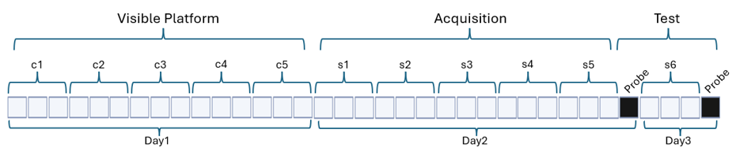

# Foster Lab

Shared column naming, key-file formats, combining, and the GUI are in the [project README](../README.md). This file covers Foster import sources and keys.

## Overview

Rats included in the Foster Lab dataset are F344 rats tested as part of ongoing studies from 2003 to 2024. Data for each trial are reported as the average of three sequential trials, according to the protocol diagram below. The dataset is limited to male control animals (i.e., animals that received no drug or viral treatments). Some animals were housed in enriched conditions, and others may have received vehicle treatments. Visible-platform (Cue) trials were performed on one day, prior to hidden-platform (spatial acquisition) trials. Only animals judged not to have deficits in acquiring the procedural aspects of the task during the single day of Cue training are included. A probe trial was performed following the final spatial trial. Twenty-four-hour retention for the hidden-platform location was assessed on the following day, preceded by three hidden-platform trials. For probe trials, rats were released from the quadrant opposite the goal and given 60 s of swim time; time and distance in the goal (quadrant 3) and opposite (quadrant 1) quadrants were collected, and a discrimination index was calculated. Ethovision software was used for video capture and analysis of individual trials. Raw data is  **wide format** (one row per animal). `import_scripts/foster_import.py` loads the prepared table without trial-level reshaping; `combine_data.py` applies `shared_keys.json`.



## Folder layout

```
foster/
├── foster.csv              # Combined output used by IDCARD
├── keys/
│   └── trial_type_key_foster.csv
└── rat_data/
    └── foster_data.csv     # Source wide-format data
```

## Import

```powershell
python -m import_scripts.foster_import
```

Loads `foster/foster.csv` (or `rat_data/foster_data.csv` as the upstream source). No per-trial merge or column renaming in the import script.

Source columns already follow `<variable>_<trial_type>_<trial_number>`. Foster does not currently include `dist_total`, `dist_mean`, `mean_speed`, `datetime_trial`, or `cumulative_time`.

## Trial column mapping

| Standardized variable | Source column | Notes |
|-----------------------|---------------|--------|
| `dist_cum` | `cum_dist_<type>_<n>` | Renamed at combine (`cum_dist` → `dist_cum`) |
| `duration` | `duration_<type>_<n>` | Direct use |
| *(not in shared_keys)* | `timegoal_p_<n>` | Probe; time in goal quadrant |
| *(not in shared_keys)* | `timeopp_p_<n>` | Probe; opposite quadrant |
| *(not in shared_keys)* | `di_p_<n>` | Probe; discrimination index |

- Visible: `duration`, `cum_dist` with `_c_1` … `_c_5`
- Spatial: `duration`, `cum_dist` with `_s_1` … `_s_6`
- Probe: `timegoal`, `timeopp`, `di` with `_p_1`, `_p_2`

## Metadata

Present in the source / `foster.csv` unless noted.

| Column | Notes |
|--------|--------|
| `study`, `treatment`, `animal` | Source |
| `age_category`, `months`, `age_mo`, `sex`, `strain`, `genotype` | Source |
| `pi_name`, `protocol_id`, `housing`, `tracking_system`, `rat_source`, `pool_diam` | Present in `foster.csv` (`pool_diam` converted to `183` centimeters on import) |
| `lights_on` / `lights_off` | From `light_on` / `light_off` at combine |

## Keys

- **`keys/trial_type_key_foster.csv`** — Foster protocol trial numbering.
- **`shared_keys.json` (Foster)** — metadata and `cum_dist` → `dist_cum`.
