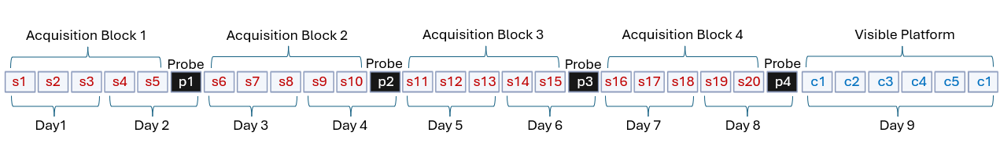

# Gallagher Lab

Shared column naming, key-file formats, combining, and the GUI are in the [project README](../README.md). This file covers Gallagher import sources and keys.

## Overview

The rats selected for inclusion in the Gallagher lab data set were collected as monthly cohorts between 2008 and 2023 as part of studies of cognitive aging in outbred Long Evans rats under a long running Program Project grant from the National Institute of Aging (P01AG009973, Michela Gallagher PI). The structure for the lab protocol is outlined in detail in Gallagher et al., 1993.

Videos for individual trials were collected and analyzed using HVS Morris Water Maze. Raw data is organized by year and cohort under `rat_data/`. The raw data was extracted from raw 'WET' HVS files by a custom software package. Each cohort has three CSVs: block (`*BL1.csv`), index (`*IN1.csv`), and trial (`*TR1.csv`). `import_scripts/gallagher_import.py` classifies Spatial / Probe / Visible, pivots to wide format, and concatenates.

`gallagher.csv` is the curated file used by IDCARD. Running the import writes intermediates under `rat_data/` and . Distance and speed are stored in cm / cm/s and divided by 100 at combine time.

Animal IDs are `{YY}{MM}-{NUMBER}.MG` (e.g. `0801-14.MG`) where YY and MM are the date that water maze testing was performed. Protocol and data organization are further described below.



## Folder layout

```
gallagher/
├── gallagher.csv                         # Curated combined output used by IDCARD
├── keys/
│   ├── keyFileTrials.csv
│   └── trial_type_key_gallagher.csv
└── rat_data/
    ├── <year>/<cohort>/{data,DATA}/      # Raw HVS BL1 / IN1 / TR1
    ├── formattedData/                    # Per-cohort wide CSVs
    ├── gallagher_data.csv                # Concatenated import output
    └── gallagher_data_passedCue.csv      # avg visible latency ≤ 15 s
```

## Import

```powershell
python -m import_scripts.gallagher_import
```

Writes `rat_data/formattedData/` plus `gallagher_data.csv` and `gallagher_data_passedCue.csv`.

1. Find complete cohort folders with `*BL1.csv`, `*IN1.csv`, and `*TR1.csv`. Paths containing `skipped` are ignored.
2. Drop habituation (`BLOCK == 0`); remap `BLOCK == 7` to `5` so cue follows spatial blocks.
3. Classify from `COND`: `TT` → Spatial (`s`), `FS` → Probe (`p`), `CUE` → Visible (`c`).
4. Assign sequential numbers and suffixes from `keyFileTrials.csv` and `trial_type_key_gallagher.csv`.
5. Build metadata; pivot to one wide row per animal; add `protocol_time_*` from the trial-type key.
6. Concatenate; compute `avg_visible_latency` from cue trials 1–6; write passed-cue subset (`<= 15`).

Protocol: 30 trials over 9 days — four 2-day spatial/probe blocks (5 hidden + 1 probe) then 6 visible trials on day 9.

HVS exports have no per-trial clock time, so `datetime_trial_*` and `cumulative_time_*` are not computed. `protocol_time_*` is used instead.

## Trial column mapping

Trial suffixes: `s_1`–`s_20`, `p_1`–`p_4`, `c_1`–`c_6`. Internal names use `ttr_*` prefixes.

| Standardized variable | Raw source | Internal name (post-import) |
|-----------------------|------------|-----------------------------|
| `dist_total` | `PATH` (TR1) | `ttr_dist_<type>_<n>` |
| `dist_cum` | `CUMDS` (TR1) | `ttr_cum_dist_<type>_<n>` (search error / cumulative distance) |
| `dist_mean` | `TAVDS` (TR1) | `ttr_cum_dist_mean_<type>_<n>` |
| `mean_speed` | `SPEED` (TR1) | `ttr_mean_speed_<type>_<n>` (cm/s) |
| `duration` | `LAT` (TR1) | `ttr_duration_<type>_<n>` |
| `trial_num` | `TRIAL` + block → `keyFileTrials.csv` | `trial_num_<type>_<n>` (1–30) |
| `date` | `RUNDATE` (TR1) | `date_<type>_<n>` |
| `block` | `BLOCK` (TR1) | `block_<type>_<n>` |
| `protocol_time` | trial-type key | `protocol_time_<n>` |

Block-averaged columns from `*BL1.csv` (e.g. `avg_duration_t_b1`, `avg_cum_dist_t_b1`, annulus crossings) are Gallagher-specific and are not remapped in `shared_keys.json`. Extra HVS distance-bin columns in trial files are ignored.

## Metadata

From `*IN1.csv`, the cohort folder name, and import constants.

| Column | Source / derivation |
|--------|---------------------|
| `subject_id` / `animal` | `{YY}{MM}-{NUMBER}.MG` from `NUMBER` + filename prefix |
| `age` / `age_mo` | `24` if `AGE == 'O'`, else `6` |
| `sex` | `'female'` if cohort folder contains `f` (e.g. `m11f`), else `'male'` |
| `strain` / `genotype` | `'Long Evans'` / `'Wild Type'` |
| `watermaze_date` | Earliest `RUNDATE` in the cohort |
| `calculated_index` | `IDX30_3`; animals with `0` dropped |
| `lights_on` / `lights_off` | `'7:00'` / `'19:00'` (import names `light_on` / `light_off`) |
| `index_calc_type` | `'Gall_SearchError'` |
| `tracking_system` | `'HVS'` |
| `rat_source` | `'CharlesRiver'` (`source_id` in import output) |
| `housing` / `subsequent_measures` | `'Single'` / `'No'` |
| `pool_diam` | `184` (centimeters) |
| `protocol_id` / `pi_name` | `'Gallagher_WM_1'` / `'Gallagher'` |
| `probe_weight_p_2` / `_p_3` / `_p_4` | `'1.26'` / `'1.43'` / `'1.43'` |

## Raw source columns

Only these columns are read.

### Index (`*IN1.csv`)

| Column | Definition |
|--------|------------|
| `NUMBER` | Animal number within the cohort |
| `GROUP` | Cohort / group code |
| `YEAR` | Calendar year of testing |
| `AGE` | `O` (old → 24 mo) or young (→ 6 mo) |
| `IDX30_3` | Learning index (weighted probe search error; Gallagher et al., 1993) |

### Trial (`*TR1.csv`)

| Column | Definition |
|--------|------------|
| `NUMBER`, `GROUP` | Animal / group |
| `TRIAL` | Trial number within the block |
| `DAY` | Protocol day (`01`–`08`, or `CT` for cue) |
| `BLOCK` | `0` habituation (dropped); `1`–`4` spatial/probe; `7` remapped to `5` for cue |
| `COND` | `TT` Spatial, `FS` Probe, `CUE` Visible |
| `RUNDATE` | Trial date |
| `LAT`, `SPEED`, `PATH` | Latency (s), speed (cm/s), path length (cm) |
| `CUMDS`, `TAVDS` | Cumulative and time-averaged search error |

### Block (`*BL1.csv`)

`NUMBER`, `GROUP`, `BLOCK`, `COND`, `BSPEEDTT`, `TAVDS30`, `TTPATH`, `TTLAT`, `TMQUADB`, `TMQUADD`, `ANCROSB`, `ANCROSD`

## Keys

- **`keys/keyFileTrials.csv`** — four-row table (no header) mapping labels (`s_1`, `p_1`, `c_1`, …) to sequential numbers 1–30 and protocol day.
- **`keys/trial_type_key_gallagher.csv`** — trial number → type, day, suffix, `new_suffix2` (`_1` … `_30`), `protocol_time`.
- **`shared_keys.json` (Gallagher)** — e.g. `subject_id` → `animal`, `ttr_dist` → `dist_total`; cm / cm/s conversion.
