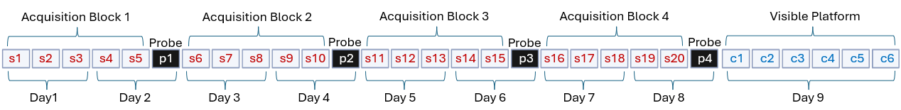

# McQuail Lab

Shared column naming, key-file formats, combining, and the GUI are in the [project README](../README.md). This file covers McQuail import sources and keys.

## Overview

The rats in the McQuail Lab dataset came from two sets of studies: F344 × Brown Norway F1 (F344 × BN-F1) hybrid rats tested at Wake Forest and F344 rats tested at University of South Carolina. The Wake Forest FBN rats were males spanning 6–28 months (McQuail & Nicolle, 2015), while the USC studies included males and females spanning 4–26 months (Faghihi et al., 2026). Rats were tested using the protocol outlined in the figure below, as in Gallagher et al., 1993. A subset of the USC rats also completed either reversal learning or delayed match-to-place testing after spatial reference memory and before cue training. These trials can be found in `rat_data\mcquail_data_plus.csv` with trial_type `Train-Rev` and
'Probe-Rev' but are not automatically imported when accessing data with the GUI. Probe weights used for computing the spatial learning index were specific to the study and strain following the general approach described by Gallagher et al., 1993 as outlined in the respective papers, rather than applying one common set of weights across both datasets. Videos for individual trials were analyzed with Ethovision software, and selected data variables were exported to Excel. The primary source is a long-format csv file: `rat_data/mcquail_data_plus.csv` (one row per trial). 

`import_scripts/mcquail_import.py` filters subjects, assigns types, pivots to wide format, and writes `mcquail.csv`. Animal IDs get a `.JM` suffix. 



## Folder layout

```
mcquail/
├── mcquail.csv
├── keys/
│   ├── mcquail.json
│   └── trial_type_key_mcquail.csv
└── rat_data/
    ├── mcquail_data_plus.csv   # Primary import source
    ├── mcquail_data_all.csv
    └── supp_files/
```

## Import

```powershell
python -m import_scripts.mcquail_import
```

1. Read `mcquail_data_plus.csv`.
2. Parse `trial`, `block`, `day_num`; `trial_num_cum = (trial + day * 3) - 3`.
3. Convert Excel serial `date`; drop reversal trials and rows with `"already"` in `Comments`.
4. Keep animals with exactly 30 trials; renumber cue trials after reversal exclusions.
5. Assign types and suffixes from `keys/trial_type_key_mcquail.csv`; pivot to `{base}_{s|p|c}_{n}`.
6. Combine `date` + `time` → `datetime_trial_*`; compute `cumulative_time_*` and `protocol_time`.
7. Append `.JM`; write `mcquail.csv`.

## Trial column mapping

| Standardized variable | Raw data source | Internal name (post-import) |
|-----------------------|-----------------|-----------------------------|
| `dist_total` | `DistanceMoved(cm)` | `dist_<type>_<n>` |
| `dist_cum` | `TotalSearchError(cm*s)` | `cum_dist_raw_<type>_<n>` |
| `dist_mean` | `MeanSearchError(cm)` | `cum_dist_mean_<type>_<n>` |
| `mean_speed` | `Velocity(cm/s)` | `mean_speed_<type>_<n>` |
| `duration` | `EscapeLatency(s)` | `duration_<type>_<n>` |
| `datetime_trial` | `date`, `time` | `datetime_trial_<type>_<n>` |
| `protocol_time` | derived | `protocol_time_<type>_<n>` via `generate_protocol_time()` |
| `trial_num_cum` | `trial`, `day_num` | `trial_num_cum_<type>_<n>` |
| `block_num` | `block` | `block_num_<type>_<n>` |
| `date` / `time` | `date` / `time` | Excel serial → `%m/%d/%Y` for date |


## Metadata

| Column | Source / derivation |
|--------|---------------------|
| `animal` | `animal`; `.JM` appended |
| `video_id`, `dob`, `date_received`, `sex`, `age_mo`, `strain`, `genotype`, `rat_source` | Source file |
| `calculated_index` | Source; Gallagher 1993 weighted probe search error; NA if missing |
| `probe_weight_p2` / `p3` / `p4` | Via shared_keys |
| `lights_on` / `lights_off` | `'7:00'` / `'19:00'` |
| `index_calc_type` | `'Gallagher/SearchError'` |
| `tracking_system` | `'Ethovision'` |
| `housing` | `'Paired/Single'` |
| `pool_diam` | `183` (centimeters) |
| `protocol_id` / `pi_name` | `'McQuail_WM_1'` / `'McQuail'` |

## Raw source columns

From `mcquail_data_plus.csv` (long format). Trial type is `trial_type` (`Train`/`Spatial`, `Probe`, `Cue`/`Visible`).

**IDs / comments:** `video_id`, `block`, `animal`, `date` (MM:DD:YYYY), `time` (HH:MM), `day_num`, `trial`, `trial_type`, `PlatformQuadrant`, `StartLocation`, `Comments`

**Ethovision distance / velocity** (all types): `Distance moved Center-point Total cm`, `Velocity Center-point Mean cm/s`, `Distance to point {Zone} / Center-point Mean cm`, `Distance to point {Zone} / Center-point Total cm`  
Zones: Arena (Center), SE/NW/NE/SW Platform (Center).

**Ethovision zones** (all types): In zone Frequency, Cumulative Duration s, Latency to First s, Cumulative Duration %  
Zones: Arena, NW/NE/SE/SW Quad, SW/SE/NE/NW Annulus.

**Summary metrics:** `EscapeLatency(s)`, `DistanceMoved(cm)`, `Velocity(cm/s)`, `TotalSearchError(cm*s)`, `MeanSearchError(cm)`; Spatial: `ProbeWeight`, `MeanSearchError*ProbeWeight`; Probe: `TimeInQuad(%)`, `TimeInOppoQuad(%)`, `TimeInPrevQuad(%)`

**Subject fields in the trial file:** `calculated_index`, `rat_source`, `dob`, `date_received`, `sex`, `age_mo`, `strain`, `genotype`, `DailyAgeMos`, `group`

## Keys

- **`keys/mcquail.json`** — Ethovision / summary names → internal base names by trial type.
- **`keys/trial_type_key_mcquail.csv`** — sequential trial → type, protocol day, suffix.
- **`shared_keys.json` (McQuail)** — e.g. `cum_dist_raw` → `dist_cum`, `dist` → `dist_total`; cm conversion.

## Citations

McQuail JA, Nicolle MM. Spatial reference memory in normal aging Fischer 344 × Brown Norway F1 hybrid rats. Neurobiol Aging. 2015 Jan;36(1):323-33. doi: 10.1016/j.neurobiolaging.2014.06.030. Epub 2014 Jul 3. PMID: 25086838; PMCID: PMC4268167.

Faghihi, Z., Horovitz, D. J., Newman, L. A., Vento, P. J., & McQuail, J. A. (2026). Biological sex and normative cognitive aging across spatial learning, flexibility, and working memory in Fischer 344 rats. Behavioral Neuroscience, 140(4), 255–266. https://doi.org/10.1037/bne0000656
