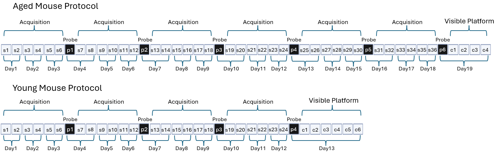

# Moore Lab

Shared column naming, key-file formats, combining, and the GUI are in the [project README](../README.md). This file covers Moore import sources and keys.

## Overview

Subjects from the Moore lab were selected from a study using custom UM-HET3/5xFAD mice, which were given either control or acarbose chow. Acarbose has been shown to extend lifespan (Harrison et al., 2014). Young and aged UM-HET3/5xFAD mice were tested in the Morris water maze to determine the effect of acarbose on cognitive decline in the context of amyloid. Videos of individual trials were analyzed with Actimetrics Watermaze and data was exported to Excel. Raw data for young and aged cohorts are included in wide format (one row per animal) in separate CSVs and use different protocols as shown in the protocol diagram below. `import_scripts/moore_import.py` remaps suffixes from age-specific trial-type keys, adds metadata, concatenates, and writes `moore.csv`. Animal IDs get a `.SM` suffix. Distance and speed are stored in cm / cm/s. For aged subjects, spatial, probe, and visible trials are included for each mouse. For young subjects, visible platform trials were performed with separate subjects.




## Folder layout

```
moore/
├── moore_young.csv
├── moore_aged.csv
├── keys/
│   ├── moore.json
│   ├── trial_type_key_y_moore.csv
│   └── trial_type_key_a_moore.csv
└── rat_data/
    └── raw_data_Acarbose 5xFAD WMW.xlsx
```

## Import

```powershell
python -m import_scripts.moore_import
```

Running the import command overwrites `moore/moore_young.csv` and `moore/moore_aged.csv`.

1. Read `rat_data/raw_data_Acarbose 5xFAD WMW.xlsx` (one workbook for both cohorts).
2. Load age-specific sheets:
   - **Young:** `training young` (spatial), `visible young` (visible), `probe young` (probe)
   - **Aged:** `training aged` (spatial), `visible aged` (visible), `probe aged` (probe)
3. Strip `*` from `Animal` / `subject_id`, append `.SM`, and copy to `animal`; map sex to M/F.
4. Map trials with the age-specific trial-type key and pivot to wide format.
5. Format dates (`%m/%d/%Y`) and times (`HH:MM`); build `datetime_trial_*` from `date_*` + `time_*`.
6. Set `watermaze_date` to the earliest trial date; add metadata constants; write `trial_num_*` from the key.
7. Compute `cumulative_time_*` (skip missing trials).

**Trial mapping rules**

| Trial type | Young source columns | Aged source columns |
|------------|---------------------|---------------------|
| Spatial | `Day` + `Trial` → `_s_*` via `protocol_day` | same |
| Probe | sheet `day` 1–4 (sequential) → `_p_1`–`_p_4` | sheet `day` 1–6 → `_p_1`–`_p_6` |
| Visible | sheet `Trial` 1–6 → `_c_1`–`_c_6` | sheet `day` 1–4 → `_c_1`–`_c_4` |

**Output (current import)**

| Cohort | `protocol_id` | Spatial | Probe | Visible | Animals |
|--------|---------------|---------|-------|---------|---------|
| Young (7 mo) | `Moore_WM_young` | 24 | 4 | 6 | 143 |
| Aged (24 mo) | `Moore_WM_aged` | 36 | 6 | 4 | 98 |

The GUI loads both files under the `moore` lab filter (see `combined/combine_data.py`).

## Trial column mapping

| Standardized variable | Raw stem | Internal name (post-import) |
|-----------------------|----------|-----------------------------|
| `dist_total` | `dist_<type>_<n>` | `dist_total_<type>_<n>` |
| `dist_cum` | `cum_dist_<type>_<n>` | `dist_cum_<type>_<n>` |
| `mean_speed` | `mean_speed_<type>_<n>` | `mean_speed_<type>_<n>` |
| `duration` | `duration_<type>_<n>` | `duration_<type>_<n>` |
| `datetime_trial` | `datetime_<type>_<n>` | `datetime_trial_<type>_<n>` |
| `trial_num` | trial-type key | `trial_num_<type>_<n>` |
| `date` / `time` | `Date` / `Time` (or probe `date` / `time_of_day`) | `date_*`; `time_*` parsed to `HH:MM` |

## Metadata

| Column | Source / derivation |
|--------|---------------------|
| `subject_id` / `animal` | `Animal` or `subject_id`; strip `*`; append `.SM` |
| `age_mo` | `age` (`7` young, `24` aged) |
| `sex` | `male`/`female` → `M`/`F` |
| `genotype`, `treatment`, `cohort`, `cage`, `hole_punch` | Source |
| `species` | `'mouse'` |
| `watermaze_date` | Earliest trial date |
| `protocol_id` | `'Moore_WM_young'` or `'Moore_WM_aged'` |
| `pi_name` | `'Moore'` |
| `subsequent_measures` | `'yes'` |
| `lights_on` / `lights_off` | `'7:00'` / `'19:00'` |
| `index_calc_type` | `'N/A'` |
| `tracking_system` | `'Watermaze'` |
| `rat_source` | `'custom'` |
| `housing` | `'Paired'` |
| `pool_diam` | `120` (centimeters) |
| `acclimation` | `'5 days handling'` |
| `tracking_marker` / `light_level` | `'no'` / `'high'` |

`strain` is listed in `shared_keys.json` but is not in the source Excel sheets.

## Raw source columns

Excel sheets use Actimetrics export column names. Training/visible sheets use `Animal`; the probe sheet uses `subject_id`.

**Subject (training / visible):** `Animal`, `Cage`, `Hole Punch`, `Genotype`, `Diet`, `Sex`, `Cohort`, `age` (visible aged only)

**Subject (probe):** `subject_id`, `cage`, `hole_punch`, `age`, `genotype`, `treatment`, `sex`, `cohort`

**Trials (training / visible):** `Date`, `Time`, `Day`, `Trial`, `Trial duration`, `Distance travelled (cm)`, `Average speed`, `Cumulative Proximity`

**Trials (probe):** `date`, `time_of_day`, `day`, `trial`, `dist_cm`, `avg_speed`, `cum_dist`

Imported wide columns use stems `dist_total`, `mean_speed`, `dist_cum`, `duration`, `date`, `time`, `datetime_trial`, `trial_num`, and `cumulative_time` with suffixes `_s_*`, `_p_*`, or `_c_*`.

## Keys

- **`keys/moore.json`** — stem mapping by trial type (Spatial / Probe / Visible / Info).
- **`keys/trial_type_key_y_moore.csv`** — young: `_s_1` … `_s_24`, `_p_1` … `_p_4`, `_c_1` … `_c_6`.
- **`keys/trial_type_key_a_moore.csv`** — aged: `_s_1` … `_s_36`, `_p_1` … `_p_6`, `_c_1` … `_c_4`.
- **`shared_keys.json` (Moore)** — identity maps for prefixes; cm / cm/s conversion in the combined dataset.
